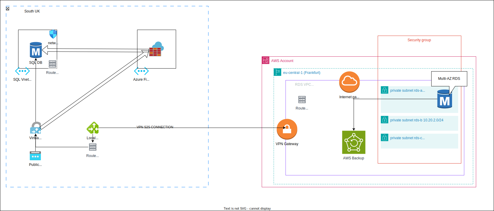

## Table of Contents
- [Destination Database](#destination-database)
- [Migration Methods](#migration-methods)
- [Network and security](#network-and-security)
- [Auxiliary services and considerations](#auxiliary-services-and-considerations)
- [Migration plan](#migration-plan)
# Destination Database
The two main options is to run MSSQL in AWS are either on a self-hosted set of EC2 instances or RDS. I would choose RDS anytime over EC2 instances unless there are client specific configurations that are not supported in RDS.    
**RDS** is easily scalable, configurable, manageable and monitorable as opposed to self-hosting clusters. It interracts with a ton of other AWS Services flawlessly.   
The migration process will need to be tested throughly before being done on production, so a migration scenario to a test environment should be used in the first place. 
Once all testing has been done in the testing environment, the same process can be applied to the production environment. 

[Back to top](#table-of-contents)
# Migration Methods

Exploring the 3 main methods for migration. 
1. **Backup and restore**  
This option requires the downtime equivalent of the cumulative time of multiple tasks - backing up the databases, encrypting the database archives, transferring them, decrypting the archives and restoring them.  
If this is done in an online fashion, then the gap between the backed-up state and the current state might be quite large.   
I would choose this option, when downtime is not a problem.   

1. **Data replication** / Data sync  
  
This option requires the use of a VM and the data is not streamed, so there is high latency. Also the throughput is dependent on the VM resources with the need to get a better disk.   
I would choose this option if we can't use DMS.   

1. **AWS DMS**  
The Data Migration Service, which AWS offers, provides synchronous transactional replication with capturing data changes. Creates the destination resources by itself, which could be configured as well. 
  
Limitations: AWS DMS needs to use MS-CDC for tables with or without primary keys, as I have chosen to use RDS. More info here: https://docs.aws.amazon.com/dms/latest/userguide/CHAP_Source.SQLServer.CDC.html#CHAP_Source.SQLServer.Configuration

[Back to top](#table-of-contents)
# Network and security
The best option in terms of privacy to set up is a site-to-site S2S VPN connection.

Azure Networks 
- VNET 10.10.0.0/16
- GatewaySubnet 10.10.255.0/24
- Virtual Network Gateway
- Local Network Gateway
- Network Security Groups
- Azure Firewall within its own VNET
- Routes to VPN GW from local subnets
- Traffic to the SQL DB can be controlled either via the AZ FW or through the NSGs. 

AWS Network 
- VPC 10.20.0.0/16
- rds-a subnet 10.20.0.0/24
- rds-b subnet 10.20.1.0/24
- rds-c subnet 10.20.2.0/24
- Customer Gateway
- Private VPN Gateway
- S2S vpn connection
- Routes to VPN GW from local subnets
- Traffic to the database is controlled via the RDS Security group, however for fine-tuning we can implement NACLs.

Database migration security
- use TLS in DMS
- use encryption at rest - either self-managed or KMS

> **_NOTE:_**  As external services were not specified, the task is defined as ambiguous, thus they are not present in the diagram, along with Entra RBAC or IAM roles and we can talk more about this in the interview. 

[Back to top](#table-of-contents)
# Auxiliary services and considerations
Logging & Monitoring - use Cloudwatch to monitor metrics, create alarms
Scaling - Scheduled/Autoscaling - based on usage & Alarms, different strategies can be implemented
Access - Create IAM roles for service accounts and users or use native mssql roles and users to grant access to tables. 
Audit - Monitor access via CloudTrail 
Security - Ensure that the database is accessed via TLS v1.2 at lowest. 
Backup - Have daily backup for 7-14 days, weekly backup up to 3 months, monthly backup up to 1 year and annual backups up to 7 years. All done via AWS Backup in a backup vault with the above backup plan. 
RDS Parameter group - make the necessary configuration to mimic the production cluster. 

[Back to top](#table-of-contents)
# Migration plan

1. Note down engine version, configuration, accounts, performance to have as a baseline for verification on database migration. 
2. Create a full backup of the database in Azure. 
3. Create the AWS (Test environment) infrastructure and VPN Connection via terraform.
4. Initiate DMS via terraform configuration. 
5. After DMS has created the database and transferred all current data, enable capturing data changes (CDC) on the new DB. https://docs.aws.amazon.com/dms/latest/userguide/CHAP_Source.SQLServer.CDC.html
6. Change traffic from the AZ to AWS SQL DB for the testing APP servers.
7. Testing Phase
&emsp; - Run Manual/Automated functionality testing jobs and load testing.
&emsp; - Monitor performance over the current baseline. 
8.  Test Conclusion phase. 
    a) If any errors or unexpected and unwanted behaviors occur then roll back the connection to the AZ SQL DB and destroy current AWS infra.  
    b) If success, then promote current AWS infrastructure to production and disconnect the testing APP servers from it and remove their access through security groups, etc. 
9.  Add Production APP Servers SG/NACL rules as needed. 
10.  Cutover phase.   
If a database lock is available during the cutover phase, initiate the lock(AZ SQL), then deploy the configuration changes, or change the FQDN in the DNS, depending on how the APP servers are configured.  
Set traffic rules to deny all access on AZ SQL DB. 
Repeat Steps 8 & 9 .

